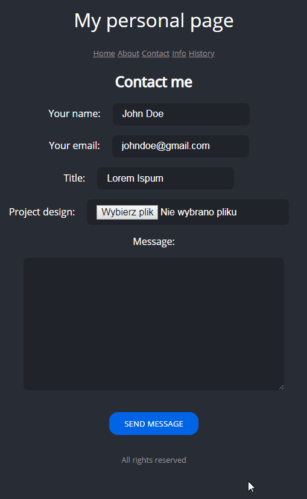

<p align="center">
</a>
</p>
<br>


# Express

Building a server using web framework Express. 


## Tech Stack

* [Express](https://expressjs.com/)
* [Postman](https://www.postman.com/)
* [Handlebars](https://handlebarsjs.com/)
* JavaScript
* HTML
* CSS

  
## Lessons

* development of knowledge on how to build servers
* follow routing methods
* use middleware functions
* use [Postman](https://www.postman.com/)
* create folder structure
* create subpages and form validation
* design layouts and use [Handlebars](https://handlebarsjs.com/)
* use documentation
* use [Nodemon](https://www.npmjs.com/package/nodemon) to live server

  
## Run 

Start the app - with live

```bash
  nodemon server.js
```

Start the app - without live

```bash
  node server.js 
```


## Authors

:woman: [@marcelaos](https://github.com/marcela-os)
